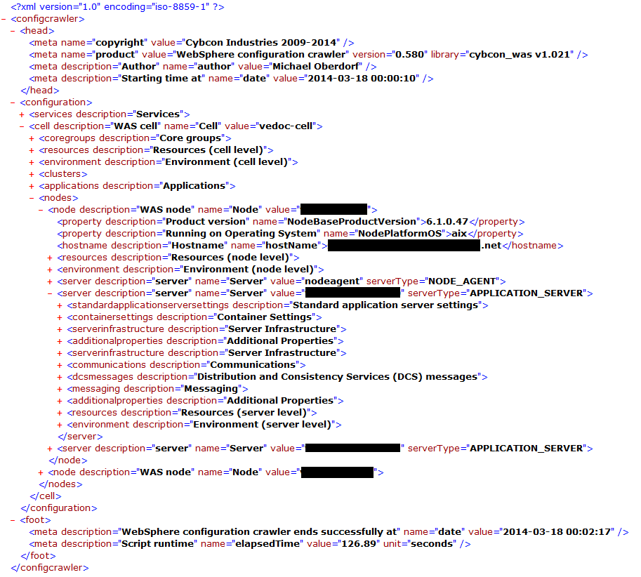
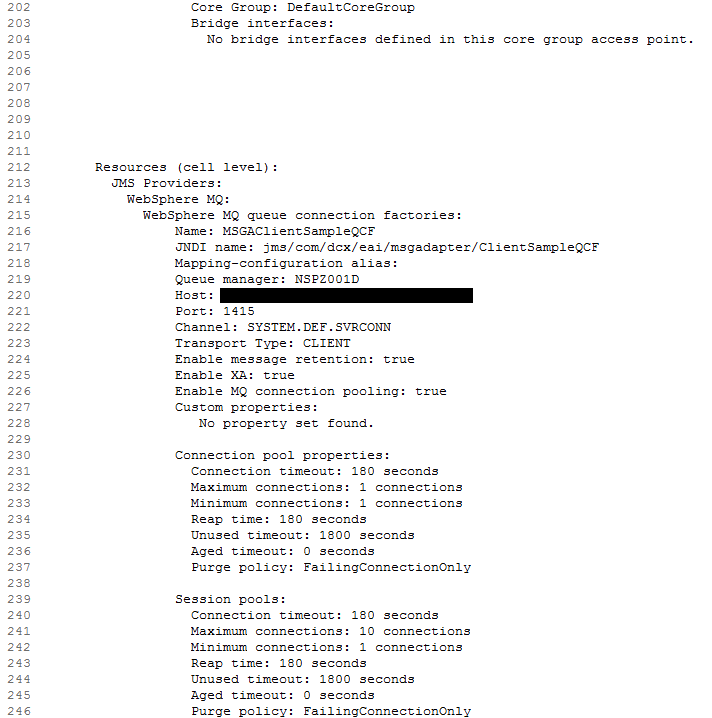
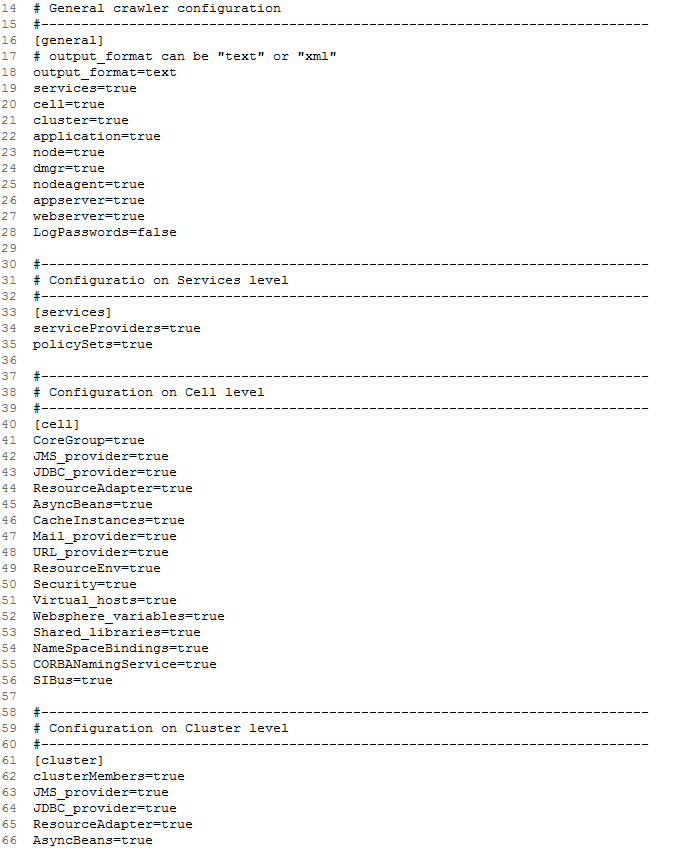

# Summary

The WebSphere ApplicationServer ConfigCrawler is a small jython script (running in a wsadmin interpreter) and is able to output a lot of information about your IBM WebSphere ApplicationServer environment.
All configurable with a small config file where you can choose the scope and the items to crawl.
Output can be set to XML (for easy computer based postprocessing) or as simple Text fo easy administration overview.

# Features
- Easy to use
- Good overview about your WAS configuration
- Runs on Windows and Unix Platforms
- Output on standard out - Redirect to file if needed
- Plaintext and XML output
- Tested on more than 400 different cells every night

# Installation instructions
1. Modify `crawler.conf` section `[cybcon_was]` and set
   `libPath=<path where we can find the cybcon_was.py file>`

2. Modify `crawler.conf` for your needs

3. execute crawler
   usage:
     `./wsadmin.sh -lang jython -f /path/to/config_crawler.py /path/to/crawler.conf`

# Project Samples

## XML output example

## Plaintext output example

## Configuration file example

